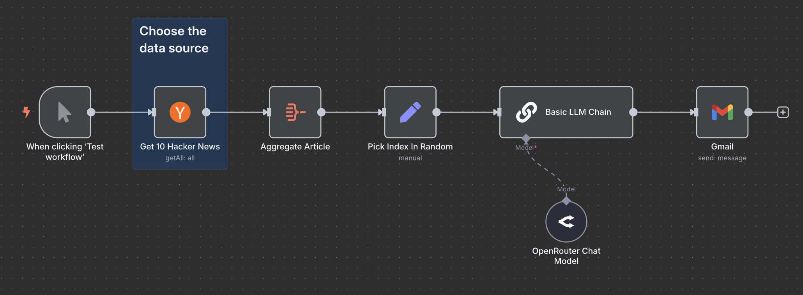

# Hacker News Summary Emailer

Built with n8n, this workflow fetches the top 10 articles from Hacker News, randomly selects one, summarizes it using AI, and emails the summary.

## Overview

This workflow provides a daily digest of Hacker News articles by summarizing a randomly selected top article and sending it via email.

## Technologies Used

- Hacker News API
- OpenRouter (AI model)
- Gmail

## Screenshot

## Live Demo

## Purpose

To enhance information consumption efficiency by delivering a summarized version of a top Hacker News article directly to the user's email.
