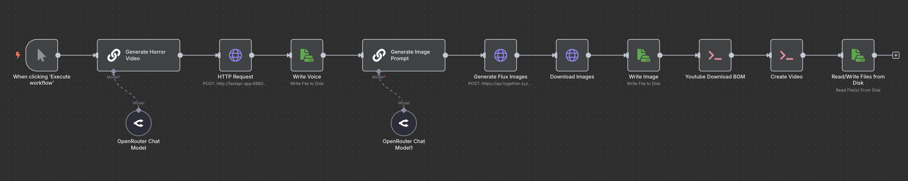

# Horror Story Video Generator

Built with n8n, this workflow generates a complete horror story video, including AI-generated transcript, audio narration, background image, and music.

## Overview

This workflow automates the creation of horror story videos by generating content with AI, converting text to speech, creating images, downloading music, and combining all elements into a final video.

## Technologies Used

- OpenRouter (AI text generation)
- Kokoro Fast API TTS (audio narration)
- Together AI (image generation)
- YouTube (background music)
- FFmpeg (video creation)

## Screenshot

## Live Demo

## Purpose

To enable the automatic generation of horror story videos, leveraging AI for content creation and multimedia integration.
