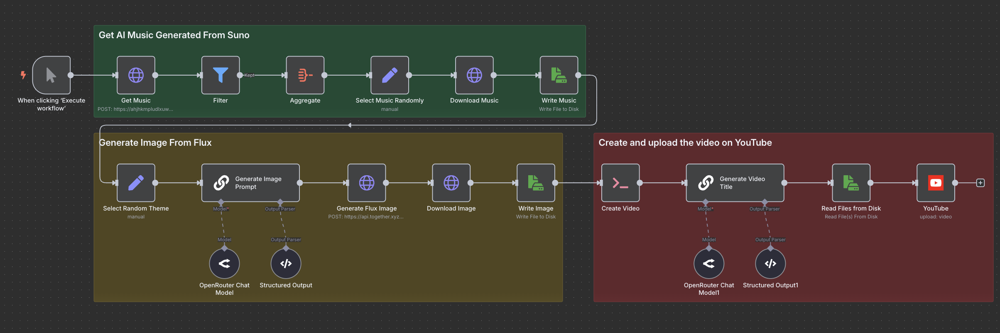

# Lofi Video Generator

Built with n8n, this workflow generates a complete lofi video, including AI-generated image, background music, and video creation.

## Overview

This workflow automates the creation of lofi videos by:

- Generating an image based on a random theme using AI.
- Selecting a random background music from a storage.
- Combining the image and music into a video.
- Generating a title for the video using AI.
- Uploading the video to YouTube.

## Technologies Used

- **OpenRouter** (AI text generation)
- **Together AI** (image generation)
- **Supabase** (music storage)
- **FFmpeg** (video creation)
- **YouTube** (video upload)

## Screenshot

## Purpose

To enable the automatic generation of lofi videos, leveraging AI for content creation and multimedia integration.