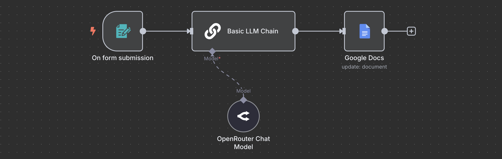

# Meeting Transcript Summarizer

Built with n8n, this workflow is triggered by a form submission containing a meeting transcript, which is then summarized using AI and stored in a Google Doc.

## Overview

This workflow automates the summarization of meeting transcripts using AI and stores the summary in a Google Doc for easy reference.

## Technologies Used

- OpenRouter (AI model)
- Google Docs

## Screenshot

## Purpose

To automate the summarization of meeting transcripts, saving time and effort in reviewing key discussion points.
