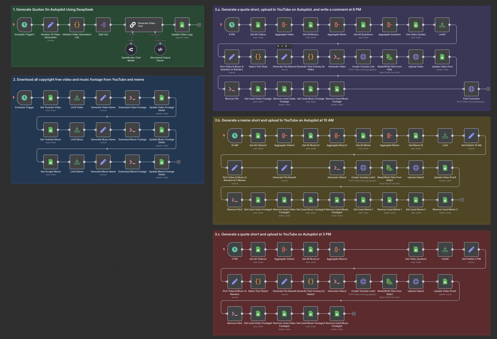

# Short Generator

Built with n8n, this workflow automates the entire process of creating motivational quote and meme shorts, from generating content with AI, managing data in Google Sheets, downloading and processing video and music footage, to scheduling and uploading the final videos to YouTube.

## Overview

This workflow streamlines the creation and scheduling of motivational quote and meme shorts on YouTube, using AI-generated content and managed through Google Sheets.

## Technologies Used

- Google Sheets
- YouTube API
- OpenRouter (AI model)
- FFmpeg (video creation)
- YT-DLP (video downloader)

## Screenshot

## Purpose

To facilitate consistent and engaging content creation for YouTube channels focused on motivational quotes and memes, with minimal manual intervention.
